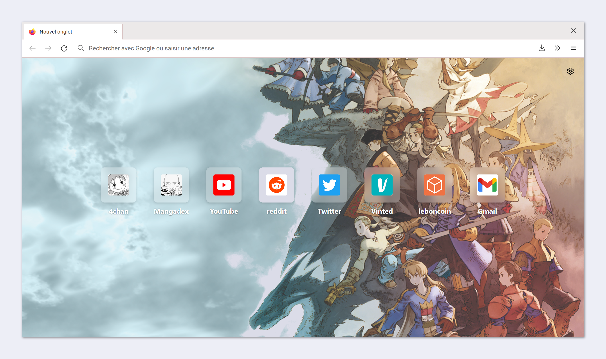

# Firefox.userChrome

About
-------------------------------

Two css scripts for <i>Mozilla Firefox.

There are two themes available : <i>Classic</i> and <i>Dark</i>.

Instruction
-------------------------------

<strong>Step 1 : Create the files</strong>

<ol>
<li>Create a file called <i>userchrome.css</i>, then choose a file (<a href="https://raw.githubusercontent.com/Catgrills/Firefox.userChrome/master/userchrome_classic.css">userchrome_classic.css</a> or <a href="https://raw.githubusercontent.com/Catgrills/Firefox.userChrome/master/userchrome_dark.css">userchrome_dark.css</a>) and copy/paste all the content.</li>
<li>Create a file called <i>userContent.css</i>, then choose a file (<a href="https://raw.githubusercontent.com/Catgrills/Firefox.userChrome/master/userContent_classic.css">userContent_classic.css</a> or <a href="https://raw.githubusercontent.com/Catgrills/Firefox.userChrome/master/userContent_dark.css">userContent_dark.css</a>) and copy/paste all the content.</li>
</ol>

<strong>Step 2 : Move the files to a specific directory</strong>
<ol>
<li> Go to C:\Users\[NAME]\AppData\Roaming\Mozilla\Firefox\Profiles\[SOMETHING].default"</li>
<li> Create a new folder and name it <i>chrome</i>.</li>
<li> Move the files in this folder.</li>
</ol>

<strong>Step 3 : Install the font </strong>

I use several fonts for my userchrome.
<ol>
<li> <a href="http://www.freejapanesefont.com/bokutachi-gothic-2-bold/">Bokutachi no Gothic 2 </a></li>
<li> <a href="https://www.fontsquirrel.com/fonts/roboto">Roboto</a></li>
</ol>

Report
-------------------------------

Don't hesitate to report any issues you find while using this userchrome.
